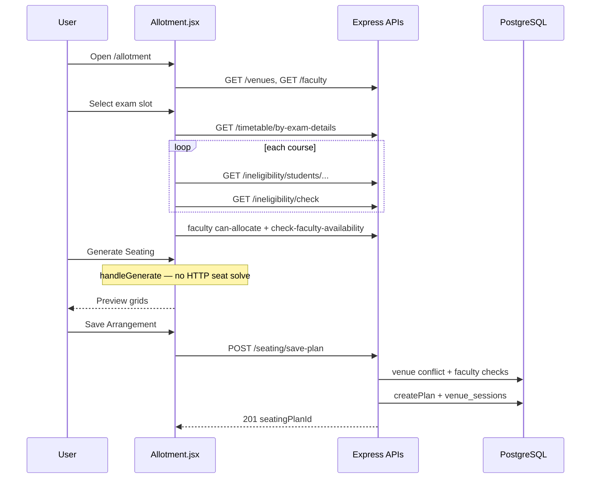

# Hallora Seating Algorithm — Execution Flow

> **Scope:** Reverse-engineering of the *production* seating path only.  
> **Rule:** No source was modified for this document.  
> **Critical finding:** Seat **generation is entirely client-side** in `src/pages/Allotment.jsx` (`handleGenerate`). There is **no** `POST /api/seating/generate` endpoint. The backend validates conflicts and **persists** what the browser already computed.

---

## 1. Architecture (high level)

```text
┌─────────────────────────────────────────────────────────────────┐
│  BROWSER  src/pages/Allotment.jsx                               │
│                                                                 │
│  Load data  →  Filter students  →  handleGenerate()             │
│                     (greedy vertical fill + adjacency)          │
│                              ↓                                  │
│                     Preview grids in UI                         │
│                              ↓                                  │
│                     handleSave() → JSON payload                 │
└──────────────────────────────┬──────────────────────────────────┘
                               │  POST /api/seating/save-plan
┌──────────────────────────────▼──────────────────────────────────┐
│  Express  backend/routes/seatingRoutes.js                       │
│  sessionAuth → checkRole → auditLogger → handler                │
│  Venue.isAvailable  ·  faculty allocation/time checks           │
│                              ↓                                  │
│  SeatingPlan.createPlan  (backend/models/SeatingPlan.js)        │
│  seatingLayout.flattenArrangementForStorage                     │
│  Venue.addSession                                               │
│                              ↓                                  │
│  PostgreSQL: seating_plans, seating_plan_students,              │
│              seating_plan_venues, seating_arrangements,         │
│              venue_sessions                                     │
└─────────────────────────────────────────────────────────────────┘
```

**There is no Seating Controller / Seating Service layer for generation.** Logic lives in the React page. Persistence uses fat route handlers + model objects (Hallora convention).

---

## 2. Complete execution flow

```text
User opens /allotment
        │
        ▼
AuthGuard (src/App.jsx) — sessionStorage.authToken
        │
        ▼
Allotment mount
        │
        ├─► useEffect []  (Allotment.jsx:188–210)
        │     GET /api/venues          → setVenues(isAvailable only)
        │     GET /api/faculty         → setAllFaculty
        │
        ├─► User sets examDate, examStartTime, examEndTime, examSession
        │
        ├─► useEffect exam slot  (Allotment.jsx:213–307)
        │     GET /api/timetable/by-exam-details
        │     for each course:
        │       GET /api/ineligibility/students/:courseCode/:department
        │     setTimetableCourses, setStudentsByCourse, setExamType
        │
        ├─► useEffect ineligibility  (Allotment.jsx:309–360)
        │     GET /api/ineligibility/check (per course + examType + date)
        │     setIneligibleStudentsByCourse
        │
        ├─► useEffect faculty enrichment  (Allotment.jsx:363–413)
        │     GET /api/faculty/:id/can-allocate
        │     POST /api/seating/check-faculty-availability
        │     merge canAllocate, hasTimeConflict onto allFaculty
        │
        ├─► User chooses seatingMode auto|manual, facultyMode AUTO|MANUAL,
        │    optional excludedBatches, allowAdjacentSeating
        │
        ▼
[Generate Seating] → handleGenerate()  (Allotment.jsx:454–799)
        │
        ├─ Prechecks: role, past date, exam fields, courses, venues
        ├─ Build eligible students (batch + ineligibility filters)
        ├─ Sort courses by eligible count DESC
        ├─ Capacity gate: sum(venue.capacity) >= totalStudents
        ├─ Build venueGrids (null grids + benchConfig)
        ├─ Multi-pass vertical fill + 3 adjacency rules
        ├─ Optional override pass (if allowAdjacentSeating)
        ├─ Skip empty venues; format cells; AUTO faculty round-robin
        └─ setGeneratedSeating / setAllottedStudents  (preview only)
        │
        ▼
[Save Arrangement] → handleSave()  (Allotment.jsx:801–871)
        │
        ▼
POST /api/seating/save-plan  (seatingRoutes.js:20–187)
        │
        ├─ Validate exam fields + venuesUsed nonempty
        ├─ Venue.isAvailable per venue (venue.js:138+)
        ├─ Faculty max_classrooms + exam time overlap SQL
        ├─ SeatingPlan.createPlan (SeatingPlan.js:28–148)
        │     INSERT seating_plans
        │     INSERT seating_plan_students
        │     INSERT seating_plan_venues (+ seating_layout_json, bench_config)
        │     flattenArrangementForStorage → INSERT seating_arrangements
        ├─ Venue.addSession per venue
        └─ COMMIT → 201 { seatingPlanId, ... }
```

---

## 3. Call graph (generation + save)

| Step | Symbol | File | Lines |
|------|--------|------|-------|
| UI click Generate | `handleGenerate` | `src/pages/Allotment.jsx` | 454–799 |
| Normalize helpers | `normalizeStudent`, `normalizeCourse` | same | 51–65 |
| Save click | `handleSave` | same | 801–871 |
| HTTP save | `api.post("/seating/save-plan", payload)` | same | ~852 |
| Route | `router.post("/save-plan", …)` | `backend/routes/seatingRoutes.js` | 20–187 |
| Availability | `Venue.isAvailable` | `backend/models/venue.js` | ~138–160 |
| Persist | `SeatingPlan.createPlan` | `backend/models/SeatingPlan.js` | 28–148 |
| Flatten seats | `flattenArrangementForStorage` | `backend/utils/seatingLayout.js` | 9–38 |
| Book hall | `Venue.addSession` | `backend/models/venue.js` | ~162–177 |
| Layout hydrate (read path) | `hydrateArrangementFromRows` | `backend/utils/seatingLayout.js` | 40–69 |
| Mount API | `app.use("/api/seating", seatingRoutes)` | `backend/server.js` | ~71 |

**Not in generation path:** `backend/python/solver.py`, `/api/ortools/*` (demo only).

---

## 4. Important runtime objects

### 4.1 Frontend state (`Allotment.jsx` ~95–135)

| Object | Meaning |
|--------|---------|
| `venues` | Available halls from API |
| `timetableCourses` | Courses for selected exam slot |
| `studentsByCourse` | Map `` `${courseCode}-${department}` → student[] `` |
| `seatingMode` | `"auto"` \| `"manual"` venue selection |
| `selectedVenues` | Manual venue list |
| `generatedSeating` | Preview: `{ venue, seats, facultyId, previewFacultyName }[]` |
| `allottedStudents` | Flat list of seated student objects for save |
| `facultyMode` | `"AUTO"` \| `"MANUAL"` |
| `allowAdjacentSeating` | Enables override second pass |
| `ineligibleStudentsByCourse` | Map → `Set(regnNo)` |

### 4.2 Internal generation structures (`handleGenerate`)

| Object | Shape |
|--------|-------|
| `venuesToUse` | Venue list (auto: capacity-desc sorted; manual: selection order) |
| `studentsByCourseKey` | Eligible students after filters |
| `sortedCourses` | `[{ key, students }]` largest cohort first |
| `venueGrids` | `[{ venue, grid[r][c], benchConfig }]` |
| `grid[r][c]` | `null` → then `Array` of slot students |
| Slot student | Full student + `courseDescription` (= course code), `department` |

### 4.3 Persist payload (`handleSave` 821–839)

```text
{
  examDate, examStartTime, examEndTime, examSession, examType,
  selectedCourses: string[],
  students: allottedStudents,
  facultyMode,
  venuesUsed: [{
    venueId, venueName,
    seatingArrangement,   // 2D: "Empty" | [{regn_no, course}|null]
    benchConfig,
    facultyId
  }]
}
```

### 4.4 Database entities (`SeatingPlan.createPlan`)

| Table | Role |
|-------|------|
| `seating_plans` | Header (date, session, type, times, courses JSON, faculty_mode, owner) |
| `seating_plan_students` | Roster snapshot |
| `seating_plan_venues` | Per-room layout JSON + bench_config + faculty_id |
| `seating_arrangements` | Normalized (row, col, seat_index, regn_no) |
| `venue_sessions` | Books hall for time window |

---

## 5. API surface used by Allotment (not generate)

| Method | Path | Role in pipeline |
|--------|------|------------------|
| GET | `/api/venues` | Venue + capacity + benchConfig |
| GET | `/api/faculty` | Faculty pool |
| GET | `/api/timetable/by-exam-details` | Courses for slot |
| GET | `/api/ineligibility/students/:code/:dept` | Student pool |
| GET | `/api/ineligibility/check` | Ineligible regs |
| GET | `/api/faculty/:id/can-allocate` | Capacity headroom |
| POST | `/api/seating/check-faculty-availability` | Time conflicts |
| POST | `/api/seating/save-plan` | Persist only |
| GET | `/api/seating`, `/api/seating/:id` | Read plans (reports) |
| DELETE | `/api/seating/delete-plan/:id` | Remove plan |

---

## 6. Mermaid sequence (generate → save)



---

## 7. Design conclusion for migration readers

1. **Algorithm engine = browser greedy heuristic**, not a backend optimizer.  
2. **Backend is a validation + persistence gate**, not a generator.  
3. Any OR-Tools migration that “replaces the algorithm” must decide whether solving moves **server-side** (recommended) while keeping the same JSON layout contract consumed by Report/PrintLayout.  
4. See `constraints.md`, `algorithm_analysis.md`, and `migration_plan.md` for constraint mapping and migration steps.
