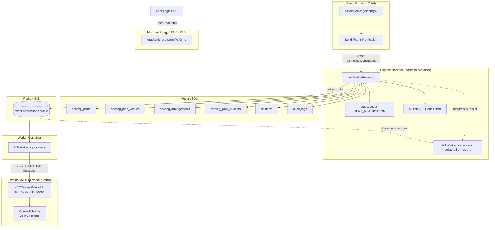

# Hallora — Hall Module Microsoft Teams Notification Flow Audit

**Date:** 2026-08-02  
**Environment audited:** Production VPS `http://213.210.37.189:3002/Hall`  
**Scope:** Hall module (`/Hall`) notification lifecycle only — **Attendance module excluded**  
**Audit type:** Code review + architecture analysis (no code changes)

---

## Executive Summary

| Item | Finding |
|------|---------|
| **Hall module purpose** | Displays **Exam Hall Allotment** sheets (hall, batch, roll ranges) from finalized **seating plans**; supports PDF export and manual Teams notifications to students. |
| **Notification trigger** | **Single manual action:** Admin or Faculty Incharge clicks **“Send Teams Notification”** after selecting Date + Session (FN/AN). |
| **Delivery mechanism** | **Not Microsoft Graph API.** Messages are sent via an internal **KCT Teams proxy API** (`POST http://10.1.76.76:25001/send/`) with HTTP Basic Auth. |
| **Microsoft Graph usage** | Used **only for user SSO login** (`User.Read`), **not** for Teams messaging in the Hall flow. |
| **Queue** | **Bull + Redis** (`exam-notifications` queue); jobs processed by a dedicated `worker` Docker service **and** inadvertently by the `backend` service (duplicate processors). |
| **Recipients** | **Students only** (email from `students` table). Faculty, HoD, Admin, and invigilators are **not** notified. |
| **Production risk (Critical)** | Worker container lacks `KCT_TEAMS_*` env vars; defaults point to campus LAN IP `10.1.76.76`, likely **unreachable from Hostinger VPS**. |
| **Persistence** | No `notification_logs` / `hall_notifications` table; delivery status exists only in Redis/Bull and console logs. |

---

## 1. Current Notification Flow

### 1.1 What the Hall Module Does

The Hall module (`src/pages/StudentArrangement.jsx`, routed at `/Hall` and `/hall`) is an **Exam Hall Allotment** viewer:

- Loads all seating plans via `GET /api/seating`
- Filters client-side by **Date** and **Session** (FN / AN)
- Renders printable hall allotment tables (Hall No, Year/Branch, Course Code, Roll ranges, Count)
- Supports **Export as PDF** (browser print)
- Supports **Send Teams Notification** (admin / faculty_incharge only)

It does **not** create or modify seating plans. Plan creation happens elsewhere (Allotment / Seating workflow via `POST /api/seating/save-plan`).

### 1.2 Step-by-Step Notification Process

```text
1. User opens /Hall (roles: admin, faculty_incharge, hod)
2. Frontend loads seating plans → GET /api/seating
3. User selects Date + Session (FN or AN)
4. UI filters halls client-side from loaded plans
5. Admin/Faculty Incharge clicks "Send Teams Notification"
6. Frontend → POST /api/notifications/teams { date, session }
7. Backend validates session auth + role (admin | faculty_incharge)
8. Backend queries seating_plans, seating_plan_venues, seating_arrangements,
   seating_plan_students, students
9. For each student with email + venue mapping → bull.add(job)
10. API returns 200 immediately ("Notification queued successfully")
11. Bull worker picks jobs from Redis
12. Worker → POST KCT Teams proxy API per student
13. Teams message delivered to student (via KCT infrastructure, not direct Graph)
```

### 1.3 Timing Model

| Stage | Sync / Async | Blocks Hall UI? |
|-------|--------------|-----------------|
| POST `/notifications/teams` | Sync (DB queries + enqueue) | Yes, until HTTP response |
| Bull job processing | Async (background) | No |
| KCT Teams API call | Async per job | No |

Hall display and PDF export are **never blocked** by failed delivery after the API returns 200.

---

## 2. Architecture Diagram



**Important correction:** The audit brief assumed **Microsoft Graph → Teams** directly. The Hall module uses a **custom KCT HTTP gateway**. Microsoft OAuth/Graph is orthogonal to Hall notifications.

---

## 3. Files Reviewed

### Frontend

| File | Role |
|------|------|
| `src/pages/StudentArrangement.jsx` | Hall UI, filters, notification trigger, status display |
| `src/App.jsx` | Routes `/Hall`, `/hall` with AuthGuard |
| `src/Components/Sidebar.jsx` | HoD nav link to `/Hall` |
| `src/lib/api.js` | Axios instance, session cookies |

### Backend — Routes & Middleware

| File | Role |
|------|------|
| `backend/routes/notificationRoutes.js` | `POST /teams`, `/progress`, queue stats/clear, exam announcements |
| `backend/routes/seatingRoutes.js` | `GET /seating` — Hall data source |
| `backend/middleware/sessionAuth.js` | Session authentication |
| `backend/middleware/checkRole.js` | RBAC |
| `backend/middleware/auditLogger.js` | Audit on successful notification request |

### Backend — Queue & Delivery

| File | Role |
|------|------|
| `backend/config/bullInit.js` | Bull queue definition, Redis, rate limiter, retries |
| `backend/config/bullWorker.js` | Job processor, KCT API client, logging |
| `backend/config/config.js` | KCT Teams API URL/credentials, Redis URL |

### Backend — Models & Services

| File | Role |
|------|------|
| `backend/models/SeatingPlan.js` | Seating plan queries |
| `backend/models/AuditLog.js` | Audit persistence |
| `backend/models/IneligibleStudent.js` | Used by exam-announcement routes, **not** Hall `/teams` |

### Auth (SSO only — not notification delivery)

| File | Role |
|------|------|
| `backend/routes/microsoftAuthRoutes.js` | Microsoft OAuth, `GET graph.microsoft.com/v1.0/me` |

### Infrastructure

| File | Role |
|------|------|
| `docker-compose.yml` | `backend`, `worker`, `redis` services |
| `.env.production.example` | Production env template |
| `.env.example` | General env template |

---

## 4. APIs Used (Hall Module)

### 4.1 Frontend → Backend

| Method | Endpoint | Purpose | Auth |
|--------|----------|---------|------|
| `GET` | `/api/seating` | Load seating plans for Hall display | admin, faculty_incharge, hod |
| `POST` | `/api/notifications/teams` | **Trigger Hall Teams notifications** | admin, faculty_incharge |

### 4.2 Related (not called by Hall UI today)

| Method | Endpoint | Purpose |
|--------|----------|---------|
| `GET` | `/api/notifications/progress` | Poll send progress (implemented backend, **not used by Hall UI**) |
| `GET` | `/api/notifications/queue/stats` | Queue counts |
| `POST` | `/api/notifications/queue/clear` | Admin clear queue |

### 4.3 External API (actual Teams delivery)

| Method | URL | Purpose |
|--------|-----|---------|
| `POST` | `{KCT_TEAMS_API_URL}` (default `http://10.1.76.76:25001/send/`) | Send HTML Teams message to student email |

**Request body:**

```json
{
  "from_email": "entry@kct.ac.in",
  "email": "<student@kct.ac.in>",
  "message": "<html>...</html>",
  "content_type": "html",
  "mention": "true"
}
```

**Auth:** HTTP Basic (`KCT_TEAMS_API_USER` / `KCT_TEAMS_API_PASSWORD`)

---

## 5. Microsoft Graph APIs

### Used in codebase (SSO login — **not Hall notifications**)

| Endpoint | Purpose | Scopes |
|----------|---------|--------|
| `https://login.microsoftonline.com/{tenant}/oauth2/v2.0/authorize` | OAuth authorize | openid, profile, email, User.Read |
| `https://login.microsoftonline.com/{tenant}/oauth2/v2.0/token` | Token exchange | — |
| `https://graph.microsoft.com/v1.0/me` | Resolve user profile on login | User.Read |

### Not used for Hall notifications

The following Graph capabilities are **not implemented** for the Hall module:

- `/users/{id}/chats` / chat messages
- `/teams/{id}/channels/{id}/messages`
- Application permissions (Mail.Send, Chat.ReadWrite, etc.)
- Azure AD object ID → Teams user mapping for messaging
- Channel or group IDs

**Conclusion:** Hall “Teams notifications” are **delegated to KCT’s internal Teams gateway**, not sent via Graph from Hallora.

---

## 6. Database Tables

### Directly involved in Hall notification flow

| Table | Role |
|-------|------|
| `seating_plans` | Match `exam_date` + `exam_session`; provides exam times, type, courses |
| `seating_plan_venues` | Hall/venue names per plan |
| `seating_arrangements` | Maps students (regn_no) to venue seats |
| `seating_plan_students` | Student ↔ course mapping per plan |
| `students` | `email`, `student_name`, `regn_no`, course metadata |
| `audit_logs` | Records `SEND_NOTIFICATION` action (request-level, not per-message) |
| `users` | Authenticated sender identity for audit |

### Not involved / do not exist

| Expected (from brief) | Status |
|-----------------------|--------|
| `hall` | **Does not exist** — halls are `venues` / `seating_plan_venues.venue_name` |
| `hall_schedule` | **Does not exist** — schedule from `seating_plans` |
| `hall_notifications` | **Does not exist** |
| `notification_logs` | **Does not exist** |

### Entity relationship (simplified)

```text
seating_plans (1) ──< seating_plan_venues (1) ──< seating_arrangements
       │
       └──< seating_plan_students (regn_no, course_description)

seating_arrangements.regn_no ──> students.regn_no (email lookup)

audit_logs.user_id ──> users.id (who clicked Send)
```

---

## 7. Queue Processing

### 7.1 Configuration

| Setting | Source | Default |
|---------|--------|---------|
| Queue name | `bullInit.js` | `exam-notifications` |
| Redis URL | `CELERY_BROKER_URL` | `redis://redis:6379/0` (Docker) |
| Max attempts | `BULL_MAX_RETRIES` | 10 (bullInit) / 5 (config.js class default) |
| Backoff | Exponential | 3000 ms initial |
| Job timeout | `BULL_JOB_TIMEOUT` | 180000 ms |
| Rate limit | `QUEUE_LIMITER_MAX` / `DURATION` | 10 jobs / 10000 ms |
| Concurrency | `bullWorker.js` | **Hardcoded to 1** (ignores env) |
| Mock mode | `MOCK_TEAMS_API=true` | Skips real API, simulates success |

### 7.2 Job lifecycle (Hall `/teams`)

1. **Create:** `bull.add({ type: "seating-notification", email, studentName, examDate, examTime, venue, courseName, courseCodes })`
2. **Wait:** Redis queue (rate-limited)
3. **Process:** Worker builds HTML message, calls KCT API
4. **Complete:** Job marked completed in Redis (`removeOnComplete: 1000`)
5. **Fail:** Retries up to max attempts; then `failed` state (`removeOnFail: 500`)

### 7.3 Retry policy

- Exponential backoff between attempts
- Console logs on retry and final failure
- **No DB record** of failed recipients
- **No alert** to admin on batch failure

### 7.4 Non-blocking guarantee

`POST /notifications/teams` returns after enqueue. Hall operations are not rolled back if delivery fails.

### 7.7 Critical architecture issue: duplicate processors

`notificationRoutes.js` requires `../config/bullWorker`, which calls `bull.process()` at module load.

- **Backend container** (`node server.js`) → loads routes → registers processor
- **Worker container** (`node config/bullWorker.js`) → registers processor again

Both consume the same Redis queue → risk of **duplicate messages**, **race conditions**, and **confusing logs**.

**Recommendation:** API should `require('./bullInit')` only; worker container alone should register `bull.process()`.

---

## 8. Notification Trigger Analysis

### Actions that trigger Teams notifications (Hall module)

| Action | Triggers notification? | Notes |
|--------|------------------------|-------|
| Open `/Hall` | No | Read-only load |
| Filter by date/session | No | Client-side only |
| Export PDF | No | Browser print |
| **Click “Send Teams Notification”** | **Yes** | Only trigger |
| Save seating plan (Allotment) | No | Separate module |
| Hall allocation change | No | No auto-notify hook |
| Hall approval/publish | No | Not implemented |

### Duplicate notification risk

| Scenario | Risk |
|----------|------|
| User clicks Send twice | **High** — two full batches enqueued |
| Duplicate Bull processors | **Medium** — same job could be processed twice in edge cases |
| Retry after partial success | **Low** — retries same job, not new job |
| No idempotency key | **High** — no dedup by date+session+email |

---

## 9. Recipient Resolution

### Who receives Hall notifications?

| Role | Receives? | How resolved |
|------|-----------|--------------|
| **Students** | **Yes** | `students.email` where `regn_no` in seating arrangements |
| Faculty / Invigilators | No | Not queried |
| Faculty Incharge | No | Sender only |
| HoD | No | Can view Hall but cannot send |
| Admin | No | Sender only |

### Resolution logic (`POST /notifications/teams`)

1. Find seating plans for `{date, session}`
2. Collect all `regn_no` from `seating_arrangements`
3. Map regn → venue via `seating_plan_venues`
4. Map regn → course via `seating_plan_students`
5. Lookup `students.email` and `student_name`
6. **Skip** if: no email, no venue mapping

### Not used

- Azure AD Object ID
- Teams User ID
- Microsoft Graph `/users` lookup
- Group or Channel IDs
- `mention: "true"` is sent to KCT API but resolution is opaque (gateway-side)

---

## 10. Notification Content

### Hall (seating-notification) message template

Built in `bullWorker.js`:

```html
<b>📢 EXAM ANNOUNCEMENT</b><br><br>
Hello <b>{studentName}</b>,<br><br>
<b>Venue:</b> {venue}<br>
<b>Course:</b> {courseName}<br>
<b>Date:</b> {examDate formatted}<br>
<b>Time:</b> {examStart - examEnd}<br><br>
Please arrive 10 minutes early.<br>
<i>— KSI</i>
```

### Field coverage vs requirements

| Field | Included? | Source |
|-------|-----------|--------|
| Hall Name / Number | Partial | `venue` (= `seating_plan_venues.venue_name`) |
| Date | Yes | `seating_plans.exam_date` |
| Session (FN/AN) | **No** | Available in plan but **not in message** |
| Exam Type | **No** | In job metadata only, not rendered |
| Subject / Course | Yes | `courseName` |
| Faculty | **No** | Not included |
| Department | **No** | Not included |
| Time | Yes | `exam_start_time - exam_end_time` |
| Action links | **No** | No deep link to portal |
| Roll number | **No** | Not in message body |

---

## 11. Logging & Audit

### Console logging (worker)

| Event | Logged? |
|-------|---------|
| Job queued | Partial (route handler summary) |
| Job processing | Yes (`bullWorker.js`) |
| Send success | Yes (duration, email) |
| Send failure | Yes (status, timeout, no response) |
| Retry | Yes |
| Final failure | Yes |
| Graph API response | N/A — KCT proxy, not Graph |
| Queue health | Yes (30s / 60s intervals) |

### Audit trail (`audit_logs`)

| Event | Captured? |
|-------|-----------|
| Notification requested | **Yes** — `SEND_NOTIFICATION` on successful POST |
| Per-recipient send | **No** |
| Delivery success/failure | **No** |
| Queue job IDs | Partial — in audit `response` if small enough |

Audit stores request body `{ date, session }` and aggregated API response stats, not individual delivery outcomes.

---

## 12. Environment & Configuration

### Required / relevant variables

| Variable | Purpose | In `.env.production.example`? | In `docker-compose` worker? |
|----------|---------|-------------------------------|----------------------------|
| `CELERY_BROKER_URL` | Redis for Bull | No (implicit in compose) | Yes |
| `KCT_TEAMS_API_URL` | Teams gateway URL | **No** | **No** |
| `KCT_TEAMS_FROM_EMAIL` | Sender email | **No** | **No** |
| `KCT_TEAMS_API_USER` | Basic auth user | **No** | **No** |
| `KCT_TEAMS_API_PASSWORD` | Basic auth password | **No** | **No** |
| `MOCK_TEAMS_API` | Test without real sends | **No** | **No** |
| `BULL_MAX_RETRIES` | Retry count | **No** | **No** |
| `MICROSOFT_*` | SSO only | Yes (empty) | N/A |

### Security concerns

| Issue | Severity | Details |
|-------|----------|---------|
| Hardcoded default credentials | **Critical** | `config.js` defaults: `iqube@kct.ac.in` / `iQube@2025` |
| Hardcoded internal IP | **Critical** | Default API URL `http://10.1.76.76:25001/send/` |
| Secrets not in production env template | **High** | Deployments may unknowingly use dev defaults |
| Microsoft Graph not used for messaging | Info | Reduces Graph permission scope but hides dependency on KCT gateway |

---

## 13. Frontend Flow

### Notification UX (`StudentArrangement.jsx`)

| Aspect | Implementation |
|--------|----------------|
| Trigger | Orange button “Send Teams Notification” |
| Access control | Hidden/disabled logic for non-admin/fi; backend enforces role |
| Validation | Requires date, FN/AN session, at least one filtered hall |
| Loading | Spinner + “Sending...” during POST |
| Success | Green banner “Notification queued successfully!” (auto-hide 5s) |
| Failure | Red banner with API error (404, 403, etc.) |
| Progress polling | **Not implemented** — `/notifications/progress` unused |
| Recipient preview | UI supports `details.queued` but **currently set to null** |
| Retry UI | None |

### HoD experience

HoD can open `/Hall` and view allotments but **cannot** send notifications (no button access, API returns 403).

---

## 14. Backend Flow (Function Chain)

```text
StudentArrangement.handleSendNotifications()
  → api.post("/notifications/teams", { date, session })
    → sessionAuth
    → checkRole(['admin', 'faculty_incharge'])
    → auditLogger("SEND_NOTIFICATION", "Notification")
    → notificationRoutes POST /teams handler
        → db.query seating_plans (date, session)
        → db.query seating_plan_venues
        → db.query seating_arrangements
        → db.query seating_plan_students (per plan)
        → db.query students (emails)
        → bull.add() × N students
        → res.json({ success, stats, queued, skipped })
    → auditLogger captures response → AuditLog.create()

[Async]
bullWorker process handler
  → build HTML message
  → sendTeamsMessage(email, message)
    → axios.post(KCT_TEAMS_API_URL, payload, basicAuth)
```

---

## 15. Security Review

| Control | Status |
|---------|--------|
| Authentication | Session cookie required |
| Authorization | `admin` and `faculty_incharge` only for send |
| HoD read-only | Correct for notifications |
| Rate limiting | Global `/api` limiter applies |
| Secret management | **Weak** — defaults in source |
| Token storage | N/A for KCT API (static basic auth) |
| Graph permissions | SSO only; no over-privileged app permissions for Hall |

---

## 16. Performance Review

| Area | Finding |
|------|---------|
| Duplicate notifications | Risk from double-click and dual processors |
| Graph API calls | None (KCT proxy instead) |
| Blocking operations | POST handler loops all students synchronously before response — slow for large cohorts |
| N+1 queries | `seating_plan_students` queried **per plan** in loop |
| Queue bottleneck | Concurrency=1, 10 jobs/10s → ~1 msg/sec max |
| Memory | Full recipient list returned in API response (can be large) |
| Progress tracking | In-memory `currentBatch` — **not shared reliably** across backend instances |

---

## 17. End-to-End Functional Test Plan

**Note:** Live delivery to Teams was not executed from this audit environment (requires VPS access + KCT gateway reachability). Use this checklist on production:

| Step | Action | Expected |
|------|--------|----------|
| 1 | Login as admin at `http://213.210.37.189:3002` | Session established |
| 2 | Navigate to `/Hall` | Seating plans load |
| 3 | Select date/session with existing plans | Halls displayed |
| 4 | Open DevTools → Network | — |
| 5 | Click “Send Teams Notification” | `POST /api/notifications/teams` → 200 |
| 6 | Verify response body | `success: true`, `stats.queued > 0` |
| 7 | Check `docker compose logs worker` | Job processing logs |
| 8 | Verify KCT API reachable from worker | HTTP 200 from gateway (not timeout) |
| 9 | Confirm student receives Teams message | Manual check on student account |
| 10 | Query `audit_logs` | `SEND_NOTIFICATION` entry |
| 11 | Poll `GET /api/notifications/progress` | Count increases (optional — UI doesn't) |

**Expected failure on current Hostinger deploy if KCT vars unset:**

Worker logs: `NO RESPONSE from API` or `ECONNREFORT` to `10.1.76.76:25001`.

---

## 18. Issues Found

### ISSUE-001 — Teams delivery uses KCT proxy, not Microsoft Graph

| | |
|---|---|
| **Description** | Documentation/expectations reference Graph API; implementation uses internal HTTP gateway. |
| **Root cause** | Architectural decision to delegate messaging to KCT infrastructure. |
| **Impact** | Graph permissions, token refresh, and Teams IDs are irrelevant; debugging requires KCT gateway access. |
| **Fix** | Document officially; add health check for KCT API; optionally add direct Graph path in future. |
| **Priority** | **Medium** (documentation / expectations) |

### ISSUE-002 — Production worker missing KCT Teams environment variables

| | |
|---|---|
| **Description** | `docker-compose.yml` worker service has no `KCT_TEAMS_*` variables. |
| **Root cause** | Env vars not wired; code falls back to campus LAN defaults. |
| **Impact** | **Notifications fail silently** on VPS after queue step; users see “queued successfully” but messages never deliver. |
| **Fix** | Add `KCT_TEAMS_API_URL`, credentials to compose + `.env.production.example`; verify network path VPS → gateway. |
| **Priority** | **Critical** |

### ISSUE-003 — Hardcoded credentials and internal IP in `config.js`

| | |
|---|---|
| **Description** | Default password and `10.1.76.76` embedded in source. |
| **Root cause** | Development defaults committed as fallbacks. |
| **Impact** | Security exposure; wrong target in production. |
| **Fix** | Remove defaults for secrets; fail fast if env missing in production. |
| **Priority** | **Critical** |

### ISSUE-004 — Duplicate Bull processors (backend + worker)

| | |
|---|---|
| **Description** | `notificationRoutes` requires `bullWorker.js`, starting `bull.process()` in API server. |
| **Root cause** | Worker logic coupled to queue client module used by routes. |
| **Impact** | Duplicate processing, duplicate messages, harder scaling. |
| **Fix** | Split: routes use `bullInit` only; worker container alone calls `process()`. |
| **Priority** | **High** |

### ISSUE-005 — No notification persistence / delivery history

| | |
|---|---|
| **Description** | No DB table for notification jobs or outcomes. |
| **Root cause** | Redis-only tracking with TTL via `removeOnComplete`. |
| **Impact** | Cannot audit who received messages; cannot retry failed recipients selectively. |
| **Fix** | Add `notification_logs` table; write on enqueue, send, fail. |
| **Priority** | **High** |

### ISSUE-006 — Frontend does not poll progress

| | |
|---|---|
| **Description** | Backend exposes `/notifications/progress`; Hall UI shows only “queued successfully”. |
| **Root cause** | UI simplified; `details` intentionally set to null. |
| **Impact** | Users assume delivery completed when only enqueue succeeded. |
| **Fix** | Poll progress until `isComplete`; show sent/failed counts. |
| **Priority** | **Medium** |

### ISSUE-007 — Incomplete message content

| | |
|---|---|
| **Description** | Session (FN/AN), exam type, roll number, faculty missing from Teams HTML. |
| **Root cause** | Minimal template in `bullWorker.js`. |
| **Impact** | Students may lack context; support queries increase. |
| **Fix** | Extend template with session, exam type, regn_no, exam name. |
| **Priority** | **Medium** |

### ISSUE-008 — No idempotency / duplicate send protection

| | |
|---|---|
| **Description** | Repeated clicks enqueue duplicate batches. |
| **Root cause** | No batch ID or dedup key. |
| **Impact** | Students receive multiple identical Teams messages. |
| **Fix** | Idempotency key `{date}_{session}` with cooldown or confirm dialog + server-side lock. |
| **Priority** | **Medium** |

### ISSUE-009 — Synchronous enqueue blocks API for large batches

| | |
|---|---|
| **Description** | Sequential `bull.add()` in loop for thousands of students. |
| **Root cause** | Inline enqueue in request handler. |
| **Impact** | Slow HTTP response, possible timeout on large exams. |
| **Fix** | Bulk enqueue job or background “prepare batch” worker. |
| **Priority** | **Medium** |

### ISSUE-010 — HoD cannot send notifications (by design)

| | |
|---|---|
| **Description** | HoD has Hall view but no send button/API access. |
| **Root cause** | RBAC limits send to admin/faculty_incharge. |
| **Impact** | May or may not match business requirements. |
| **Fix** | Confirm with stakeholders; extend role if needed. |
| **Priority** | **Low** |

---

## 19. Missing Features

| Feature | Status |
|---------|--------|
| Notification history UI | Missing |
| Per-recipient delivery status | Missing |
| Failed notification dashboard | Missing |
| Admin retry failed only | Missing |
| Auto-notify on seating finalize | Missing |
| Notify faculty/invigilators | Missing |
| Microsoft Graph direct integration | Missing (by design — uses KCT) |
| Webhook/callback from KCT gateway | Missing |
| Idempotency / deduplication | Missing |
| Bull Board / queue monitoring in prod | Disabled (`flower` profile: dev only) |
| Sentry integration for failed jobs | Not wired in worker |

---

## 20. Recommendations

### Reliability

1. Wire `KCT_TEAMS_*` env vars to **both** worker and backend; add startup validation.
2. Split `bullInit` / `bullWorker` to eliminate duplicate processors.
3. Add `notification_logs` table with status: `queued | sent | failed | skipped`.
4. Implement frontend progress polling against `/api/notifications/progress`.

### Performance

1. Bulk-add Bull jobs (`addBulk`) instead of sequential `add`.
2. Replace N+1 seating_plan_students queries with single JOIN query.
3. Return summary only from API (not full `queued` array) for large batches.

### Security

1. Remove hardcoded credentials from `config.js`; require env in production.
2. Rotate KCT API password if defaults were ever deployed.
3. Restrict KCT gateway access via VPN/firewall from VPS IP.

### Scalability

1. Run **one** worker replica with configurable concurrency after rate-limit testing.
2. Consider separate queue for Hall vs exam announcements.
3. Enable Bull Board (or Redis Insight) in production with auth.

### Monitoring

1. Alert on worker container restarts and high `failed` queue count.
2. Ship worker logs to centralized logging (Datadog, ELK, etc.).
3. Add `/health` check on worker that verifies Redis + KCT API connectivity.

### Maintainability

1. Rename UI label to **“Send Teams Notification (via KCT Gateway)”** to set expectations.
2. Document KCT API contract (request/response codes) in `docs/`.
3. Add integration test with `MOCK_TEAMS_API=true`.

### Message content

1. Include session (FN/AN), exam type, registration number, and portal link.
2. Localize dates to `Asia/Kolkata` consistently.

---

## 21. Quick Reference — Hall vs Other Notification Routes

| Route | Used by | Recipients | Trigger |
|-------|---------|------------|---------|
| `POST /notifications/teams` | **Hall module** | Students with seating | Manual (Hall UI) |
| `POST /notifications/exam-announcement-v2` | Reports / other UI | Students by course | Manual |
| `POST /notifications/exam-announcement` | Legacy | Students by course | Manual |

Only `/teams` is in scope for this audit.

---

## 22. Conclusion

The Hall module Teams notification flow is a **manual, student-targeted, asynchronous pipeline** that:

1. Reads finalized seating plan data from PostgreSQL  
2. Enqueues one Bull job per student email  
3. Delivers HTML messages through a **KCT internal Teams proxy** (not Microsoft Graph)  
4. Logs the **request** to `audit_logs` but not per-message delivery  

On the current **Hostinger VPS production** deployment, notifications are **likely failing at delivery** unless the KCT gateway is reachable and env vars are configured, because the worker relies on hardcoded campus-network defaults.

**Highest-priority improvements:** configure KCT env vars, remove hardcoded secrets, fix duplicate Bull processors, add delivery logging and frontend progress feedback.

---

*Audit performed by static code analysis of the Hallora / ClassAssign-docker repository. No application code was modified as part of this audit.*
